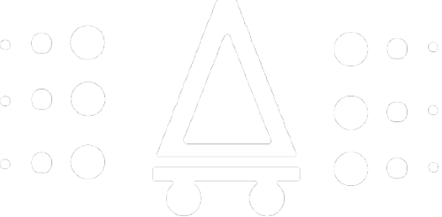

<!-- PROJECT LOGO -->
<br />
<p align="center">
  <a href="https://github.com/impatrq/asyst">
    
  </a>

  <h3 align="center">A.SYS.T</h3>
  <h4 align="center">Aeronautical system of tools</h4>

  <p align="center">
    Pedidos inteligentes
    <!-- TABLE OF CONTENTS -->
<details open="open">
  <summary>Contenidos</summary>
  <ol>
    <li>
      <a href="#sobre-el-proyecto">Sobre el Proyecto</a>
    </li>
    <!-- <li>
      <a href="#getting-started">Getting Started</a>
      <ul>
        <li><a href="#prerequisites">Prerequisites</a></li>
        <li><a href="#installation">Installation</a></li>
      </ul>
    </li> -->
    <li><a href="#manual-de-uso">Manual de Uso</a></li>
    <li><a href="#licencia">Licencia</a></li>
    <li><a href="#contacto">Contacto</a></li>
    <!-- <li><a href="#agradecimientos">Agradecimientos</a></li> -->
  </ol>
</details>
<!-- ABOUT THE PROJECT -->

## Sobre el Proyecto

**A.SYS.T (*Aeronautical system of tools*)** es un sistema que facilita el proceso de pedido y entrega de herramientas e insumos en un circuito aeronautico.
**A.SYS.T** ofrece una aplicación con una interfaz amigable en la que los trabajadores ingresarán para hacer los pedidos de herramientas e insumos que necesitarán para efectuar su trabajo, esta app cse comunicará con un servidor que generará un registro digital el cual responderá `¿Quién?, ¿Qué? y ¿Cuándo?` y, a su vez, enviará el pedido para que sea confirmado y posteriormente armado. Una vez listo el pedido un carrito autonomo recibirá el comando para iniciar su viaje y lo transportará hacia el sector de trabajo designado donde los trabajadores podrán retirarlo, usarlo y, posteriormente, devolverlo.


**Benecificios:**
* Al llevar un registro digital de los pedidos se elimina cualquier volumen de papel que se utilizaría para este mismo fin
* Como se puede fitrar el registro ante varios parámetros, se agiliza considerablemente la búsqueda de estos
* Como los pedidos se pueden hacer de forma remota, se reduce el tiempo que lleva realizar el pedido
* Se puede ahorrar el registro de devolución, pues una vez finalizado su uso el carro vuelve y marca como realizada su devolución
* El trabajador hará un menor esfuerzo físico y utilizará menos de su tiempo en el transporte de lo pedido


### Frameworks


* [Django](https://www.djangoproject.com/)
* [Bulma](https://bulma.io/)
* [uPython](https://micropython.org/)


<!-- GETTING STARTED -->
<!-- ## Getting Started

This is an example of how you may give instructions on setting up your project locally.
To get a local copy up and running follow these simple example steps.

### Prerequisites

This is an example of how to list things you need to use the software and how to install them.
* npm
  ```sh
  npm install npm@latest -g
  ```

### Installation

1. Get a free API Key at [https://example.com](https://example.com)
2. Clone the repo
   ```sh
   git clone https://github.com/your_username_/Project-Name.git
   ```
3. Install NPM packages
   ```sh
   npm install
   ```
4. Enter your API in `config.js`
   ```JS
   const API_KEY = 'ENTER YOUR API';
   ``` -->


<!-- USAGE EXAMPLES -->
## Manual de Uso

Acá vá la documentación...
[Documentation](https://example.com)


<!-- LICENSE -->
## Licencia

Acá va la licencia...
<!-- Distribuido bajo la licencia MIT. Consulte `LICENSE` para obtener más información.

<!-- CONTACTO -->
## Contacto

Equipo *A.SYS.T* - [@?]() -

Link del Proyecto: [github.com/impatrq/ayst](https://github.com/impatrq/asyst)